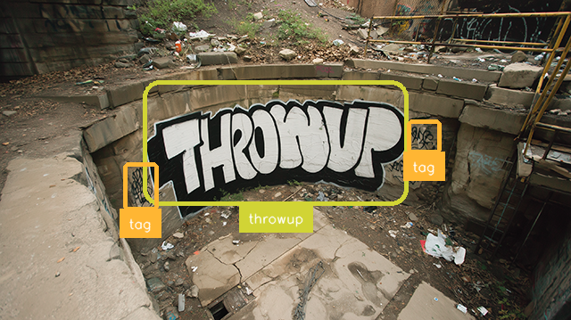

<div align="center">

# 🎨 Graffiti Detection with ONNX on Web
### [Live Demo](https://mkturkcan.github.io/cs3-ret-graffiti/)

[]([https://cs3ret.org](https://cs3-erc.org/))
[](https://reactjs.org/)
[](https://onnxruntime.ai/)
[](https://docs.opencv.org/4.x/df/df7/tutorial_js_setup.html)
[](https://github.com/ultralytics/ultralytics)
[](LICENSE)

**Real-time Graffiti Detection Application Running Directly in Your Browser**

*Developed as part of the CS3 Research Experience for Teachers (RET) Program*

---

<p align="center"><a href="https://mkturkcan.github.io/cs3-ret-graffiti/">
  </a>
</p>

<p align="center">
  <strong>Browser-based Deep Learning for Urban Art Analysis</strong><br>
  Serving YOLO11n graffiti detection model using ONNX Runtime Web with WASM backend
</p>

</div>

## 📋 Overview

This project implements a specialized YOLO11n-based graffiti detection system that runs entirely in the web browser without requiring server-side processing. Developed through the CS3 RET program, this application enables researchers, educators, urban planners, and art historians to perform real-time graffiti and street art detection and analysis directly through their web browsers.

## ✨ Key Features

- **🚀 Browser-Native Execution**: No server required - runs entirely client-side
- **🎨 Comprehensive Graffiti Detection**: Custom-trained model for accurate identification of various graffiti styles
- **⚡ Real-time Performance**: Optimized WASM backend for smooth detection
- **📸 Multiple Input Sources**: Support for image upload, webcam, and video files
- **📊 Visual Analytics**: Bounding boxes, confidence scores, and detection statistics
- **🎓 Educational Interface**: Designed for both research and educational purposes

## 🛠️ Technology Stack

- **Frontend Framework**: React 18.2
- **ML Runtime**: ONNX Runtime Web (WASM backend)
- **Computer Vision**: OpenCV.js
- **Detection Model**: YOLO11n (custom-trained for graffiti styles)
- **Build Tool**: Yarn/Webpack

## 🚀 Quick Start

### Prerequisites

- Node.js 16+ 
- Yarn package manager
- Modern web browser with WebAssembly support

### Installation

```bash
# Clone the repository
git clone https://github.com/mkturkcan/cs3-ret-graffiti.git
cd cs3-ret-graffiti

# Install dependencies
yarn install
```

### Development

```bash
# Start development server
yarn start
# Application will be available at http://localhost:3000
```

### Production Build

```bash
# Create optimized production build
yarn build
# Build files will be in ./build directory
```

## 🧠 Model Information

### Main Detection Model

Custom-trained YOLOv8n model optimized for graffiti detection:

```
Model Name : graffiti.onnx
Model Size : 10 MB
Input Shape: [1, 3, 640, 640]
Classes    : "Art", "Blockbuster", "Graffiti", "Stencil", "Tag", "Throw-up", "Masterpiece", "Sticker", "Poster"
mAP@0.5   : 0.91
```

### NMS Post-Processing

Custom ONNX model for Non-Maximum Suppression:

[](https://netron.app/?url=https://raw.githubusercontent.com/mkturkcan/cs3-ret-graffiti/master/public/model/nms-yolov8.onnx)

## 🔧 Configuration

Default detection parameters can be modified in `src/App.jsx`:

```javascript
// Model Configuration
const modelName = "graffiti.onnx";
const modelInputShape = [1, 3, 640, 640];

// Detection Parameters
const topk = 300;              // Maximum detections per image
const iouThreshold = 0.4;      // NMS IoU threshold
const scoreThreshold = 0.20;   // Confidence threshold
```

## 📁 Project Structure

```
cs3-ret-graffiti/
├── public/
│   ├── model/
│   │   ├── graffiti.onnx          # Main detection model
│   │   └── nms-yolov8.onnx        # NMS post-processing
│   └── sample_images/              # Sample graffiti images
├── src/
│   ├── components/
│   │   ├── Detector.jsx           # Main detection component
│   │   └── Results.jsx            # Results display
│   ├── utils/
│   │   ├── labels.json            # Class definitions
│   │   ├── detect.js              # Detection logic
│   │   └── preprocessing.js       # Image preprocessing
│   └── App.jsx                    # Main application
├── package.json
└── README.md
```

## 🎨 Graffiti Style Classes

The model can detect and classify the following graffiti styles:

- **Art**: Traditional street art pieces
- **Blockbuster**: Large, bold letter styles
- **Graffiti**: General graffiti writing
- **Stencil**: Stenciled artwork and text
- **Tag**: Simple signature-style writing
- **Throw-up**: Two-color bubble letters
- **Masterpiece**: Elaborate, detailed pieces
- **Sticker**: Adhesive art pieces
- **Poster**: Wheat-paste and poster art

## 📄 License

This project is licensed under the MIT License - see the [LICENSE](LICENSE) file for details.

## 🙏 Acknowledgments

- **CS3 RET Program** - For providing the opportunity and resources for this research
- **Ultralytics** - For the excellent YOLOv8 framework
- **Microsoft** - For ONNX Runtime Web
- **Urban Art Community** - For dataset collection and style expertise
- **Graffiti Research Partners** - For domain knowledge and validation
- **Original YOLOv8 Web Implementation** - [Hyuto/yolov8-onnxruntime-web](https://github.com/Hyuto/yolov8-onnxruntime-web)

---

<div align="center">

**Made with 🖤 by CS3 RET Participants**

[](https://github.com/mkturkcan/cs3-ret-graffiti)

</div>
